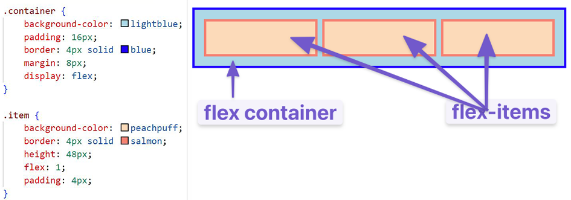
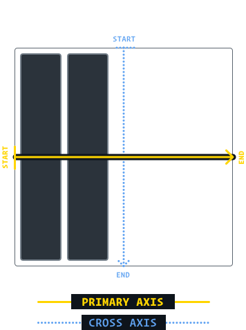
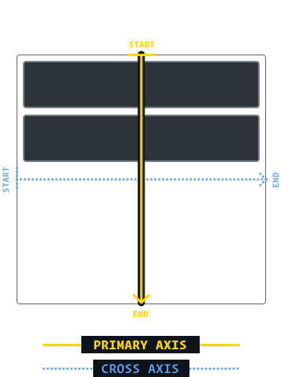

# CSS

## Intro

### Basic Syntax

- ```Selector```
    - Refers to the HTML elements to which CSS rules apply. These are what are being selected for each rule.
- Declarations
    - ```propery```
    - ```value```

Example:
```css
div.bold-text {
    front-weight: 700;
}
```
div.bold-text = ```selector```

front-weight = ```property```

700 = ```value```

### Selectors

```*``` = Universal Selector. Selects html elements of any type.

```css
* {
    color: purple;
}
```

```div```, ```p```, ```h1```, etc = Type selectors. Selects all html elements of a given type.

```css
p {
    color: white;
}

div {
    color: red;
}
```

```.<class>``` = Class selectors. Only affects html elements with the appropriate class attribute. HTML elements may have multiple classes.

```css
.alert-text {
    color: red;
}
```

```#``` = ID selectors.  HTML elements can only have one ID attribute, and only one instance of an ID can exist per page. **Use sparingly**

```css
#title {
    background-color: red;
}
```

### DRY

If two elements share some style declarations, we can combine them

not DRY:

```css
.read {
    color: white;
    background-color: black;
    /* several unique declarations */
}

.unread {
    color: white;
    background-color: black;
    /* several unique declarations */
}
```

DRY:

```css
.read,
.unread {
    color: white;
    background-color: black;
}

.read {
    /* several unique declarations */
}

.unread {
    /* several unique declarations */
}
```

### Chaining Selectors

Consider the following:

```html
<!-- HTML -->
<div>
    <div class="subsection header">Latest Posts</div>
    <p class="subsection" id="preview">Preview</p>
</div>
```
We have two elements with the class 'subsection', but we only want to access one of them.  This is where chaining can help.  **Cannot chain types**

```css
.subsection.header {
    color: red;
}

.subsection#preview {
    color: blue;
}
```

### Descendant combinator

Combinators can combine selectors differently than either grouping or chaining.  This combinator will only select a specific element if its selector matches all listed parent selectors

```html
<!-- HTML -->
<div class="ancestor">
    <!-- A -->
    <div class="contents">
        <!-- B -->
        <div class="contents">
            <!-- C -->
        </div>
    </div>
</div>

<div class="contents">
    <!-- D -->
</div>
```

Only affect B and C:

```css
/* CSS */
.ancestor .contents{
    /* some declarations */
}
```

### Properties

#### Color

```color``` = sets an element's text color

```background-color``` = sets an element's background color

> Both properties can accept these values:
>
> ```keyword``` eg. ```red``` or ```transparent```
>
> ```HEX``` eg. ```#1100ff```
>
> ```RGB``` eg. ```rgb(100,0,127)```
>
> ```HSL``` eg. ```hsl(15,82%,56%)```

#### Typography Basics and text-align

```font-family``` = single value or comma-separated list that determines a font.

> Each font falls into two categories: "font family name" or "generic family name"
>
> ```"Times New Roman"``` = font family name
>
> ```serif``` = generic family name

It is best to use a font family that you want, then use a generic font as a fallback.

```css
/* CSS */
p {
    font-family: "Times New Roman", serif;
}
```

```font-size``` = sets size of font in pixels

```css
/* CSS */
p {
    font-size: 22px;
}
```

```font-weight``` = affects the boldness of text. Can be **keyword** or a number from **1 to 1000**

```css
/* CSS */
p {
    font-weight: bold;
}

div {
    font-weight: 700;
}
```

```text-align``` = aligns text horizontally within an element using keywords.

```css
 /* CSS */
 p {
    text-align: center;
 }
```

#### Image height and width

By default, the height and width of an image is the height and width of the image file in pixels.  Use ```auto``` if you wish to save proportions while resizing.  Always include these values so that the web page allocates space for the image.

```height``` = height in pixels.

```width``` = width in pixels.

```css
/* CSS */
img {
    height: auto;
    width: 500px;
}
```

### Connecting to HTML

#### External CSS

links to an external CSS file within the ```<head>``` element.

```html
<!-- HTML -->
<head>
    <link rel="stylesheet" href="styles.css">
</head>
```

#### Internal CSS

Adding CSS within the HTML file's ```<style>``` element, inside the ```<head>``` element.

```html
<!-- HTML -->
<head>
    <style>
        div {
            color: white;
        }
        p {
            color: red;
        }
    </style>
</head>
```

#### Inline CSS

Adding styles directly to HTML elements. **Not recommended**

```html
<!-- HTML -->
<body>
    <div style="color: white; background-color: black;">
    </div>
</body>
```

## Cascade

This is what determines which rules get applied to HTML.

### Specificity

More specific declarations will take precedence over less specific ones.

1. ID selectors
2. Class selectors
3. Type selectors

Precedence of selectors of the same type are determined by the amount of instances of that selector.
```html
<!-- HTML -->
<div class="main">
    <div class="list subsection">Red text</div>
</div>
```
```css
/* CSS */
/* rule 1 */
.subsection {
    color: blue;
}
/* rule 2 */
.main .list {
    color: red;
}
```

above, rule 2 is more specific and would take precedence over rule 1.

```html
<!-- HTML -->
<div class="main">
    <div class="list" id="subsection">Red text</div>
</div>
```
```css
/* CSS */
/* rule 1 */
#subsection {
    color: blue;
}
/* rule 2 */
.main .list {
    color: red;
}
```

above, rule 1 uses an ID, which is more specific than even multiple classes, and would take precedence over rule 2.

```html
<!-- HTML -->
<div class="main">
    <div class="list" id="subsection">Red text</div>
</div>
```
```css
/* CSS */
/* rule 1 */
#subsection {
    color: blue;
}
/* rule 2 */
.main #subsection {
    color: red;
}
```

above, since both have the same number of IDs, the cascade sees that rule 2 has a class selector and rule 1 does not.  Rule 2 would then get precedence

```*``` has no specificity, meaning even type selectors will take precedence

### Inheritance

CSS properties that when applied to an element, are ingerited by that element's descendants.

```typography-based``` properties are usually inherited (```color```, ```font-size```, etc.)

Directly targeting an element will always beat inheritance.

### Rule Order

The final tiebreaker will go to the rule that is defined last.

## The Box Model

Most important thing to master with CSS is *positioning* and *layout*

Every sing thing on a webpage is a rectangular box. They may have additional boxes inside, and can sit alongside eachother.

```padding``` = the space between the border of a box and the content of the box, in pixels from **each side**. Holds the background color.

```border``` = the space between the margin and the padding, in pixels from **each side**.  Given own color.

```margin``` = the space between the borders of a box and the borders of adjacent boxes, in pixels from **each side**. Collapses with other virtical margins, giving the larger margin the priority.  4 arguments: **Top, Left, Bottom, Right** can be defined.  Can use negative values.

> 

the ```box-sizing``` attribute will calculate the entire size of an object from the ```height``` attribute.  Applying the border and padding sizes will subtract from the height value, leaving the remainder as the element size. Best practice is to add this to ```*``` (all) elements.

### Outer Display Type

#### Block

If a box is of outer display type ```block```, then:

- Box will break onto new line
- width and height properties are respected
- padding, margin, and border will cause other elements to be pushed away from box
- if width is not specified, box will extend in the inline direction to fill the space available in it's container.
- ```<h1>``` and ```<p>``` use ```block``` as outer display type by default.

#### Inline

If box has an outer display type of ```inline```, then:

- Box will not break into new line
- width and height properties will not apply
- top and bottom padding, margins, and borders will apply but will not cause other inline boxes to move away from the box
- left and right padding, margins, and borders will apply and will cause other inline boxes to move away from the box.
- ```<a>```, ```<span>```, ```<em>```, and ```strong``` use ```inline``` outer display by default

### Inner Display Type

Dictates how elements inside the box are laid out.

elements inside of a box are laid out in **normal flow** by default.

Can change the inner display type by setting ```display: flex;``` where the outer display will still be ```block```, but the inner display will become ```flex```.  Any children of this box will maintain ```flex```

## Flexbox

Flexbox is a way to arrange items into rows or columns, and these items will flex (grow and shrink)

#### Flex Container

A flex container is any element that has ```display: flex``` on it.

#### Flex Item

A flex item is any element that lives directly inside of a flex container



A flex container may also be a flex item, and vice versa


This property allows us to created complicated layouts that can scale to any screen size.


## Growing and Shrinking

```flex``` is shorthand for 3 properties that can be set on a flex item. They affect how flex items size themselves within their container.  It is shorthand for ```flex-grow```, ```flex-shrink```, and ```flex-basis```.

```flex-grow``` = expects a single number as its "growth factor".  If every element has the size 1, then they are all the same size.  Assigning an item '2' would make it twice the size.

```flex-shrink``` = is only applied if the size of all flex items is larger than the parent container.  Can apply '0' if no shrinking is desired, '1' if even shrinking is desired, or  '2+' if multiplative shrinking is desired.

```flex-basis``` = sets the initial size of a flex item so that any ```flex-grow``` or ```flex-shrink``` start from the baseline size. Default = auto. Set to ```auto``` to use the given width declaration, otherwise it will be ignored.  Also, when using the ```flex``` shorthand, the default value becomes 0, not none.

### flex shorthands

```flex: initial``` = ```flex: 0 1 auto```.  Sizes item based on width and height. Makes the flex item inflexible when there is free space, but allows it to shrink to minimum size if there is insufficient space.

```flex: auto``` = ```flex: 1 1 auto```.  Sizes item based on width and height. Makes the flex item fully flexible.

```flex: none``` = ```flex: 0 0 auto```. Sizes item according to width and height.  Makes the flex item fully inflexible.

```fles: <positive-number>``` = ```flex: <positive-number> 1 0```. Makes flex item flexible and sets basis to 0.  Receives the specified proportion of the free space in the flex container.  If all items use this pattern, their sizes will be proportional to the specified flex factor.

## Axes

FLexboxes can work vertically or horizontally, and this is adjusted by using the ```flex-direction``` attribute to set the axis of an element.

The set axis is the "main axis" and the other is the "cross axis".  The default axis is horizontal or "row".

 

Children will be bunched up at the start of the primary-axis of the container, and will stretch to fill out the entirety of the cross-axis of the container

## Alignment

```justify-content``` will align items across the main axis.

> ```flex-start``` aligns to the start of the main axis'.
>
> ```flex-end ``` aligns to the end of the main axis.
>
> ```center``` aligns to the center of the main axis.
>
> ```space-between``` aligns items equal distance across the main axis, leaving no extra space on the ends.
>
> ```space-around``` aligns items equal distance across the main axis, dividing the extra space in half on each end.
>
> ```space-evenly``` aligns items equal distance across the main axis, including the ends.

```align-items``` will align items across the cross axis.

> ```flex-start``` aligns items to the start of the cross axis.
>
> ```flex-end``` aligns items to the end of the cross axis.
>
> ```center``` aligns items to the center of the cross axis.
>
> ```stretch``` stretches item from the start of the cross axis to the end.
>
> ```baseline``` aligns items to the start of the cross axis, but lines up the bottoms of each item instead of the tops.

```align-self``` does the exact same thing as ```align-items``` but on individual items.

```gap``` will add a buffer between each item in a container.

## Uses for Flex

Flexbox is usually used for laying out a collection of items in one direction.  It also allows fluid control of the dimensions of the items in that one dimension.  People commonly use it for jobs better done by Grid Layout, as a fallback for Grid, and in order to get alignment capabilities.

### Navigation

Since nav lists are typically displayed in a horizontal bar, and lends itself well to flexbox

### Center an Item

Vertical centering is made very easy with flexbox, and centering an item on the screen is made easy using ```align-items: center``` and ```justify-content: center```

### Card layout pushing footer down

If you have a card section, and need a consistent placement of the footer no matter the amount of content, flexbox is for you.

### Media Objects

For when there is an image/video/whatever that also has text/comments to the side of it.  This allows for the media item to take up as much space as it needs with the text conforming to it.

### Form Controls

Any search bar or form entry bar should adapt to the screen size, along with the submission button remaining in the same spot.